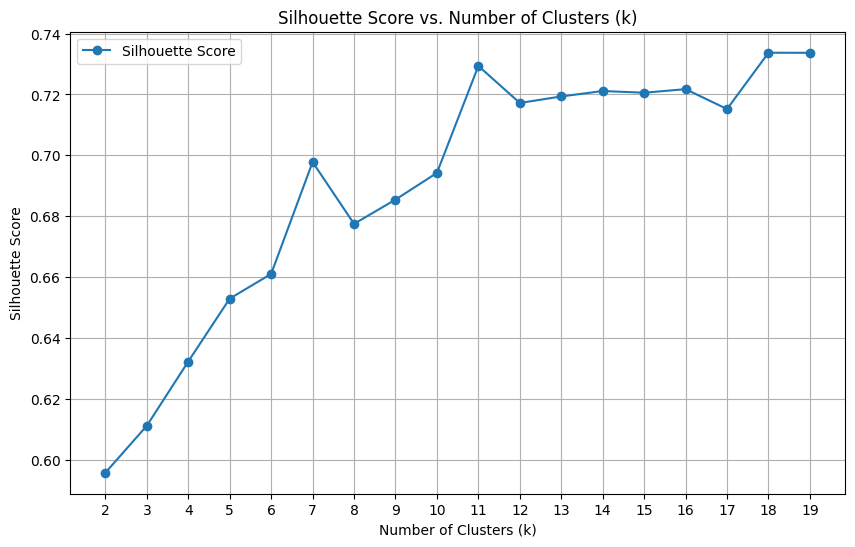
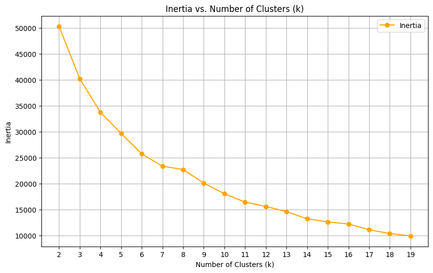
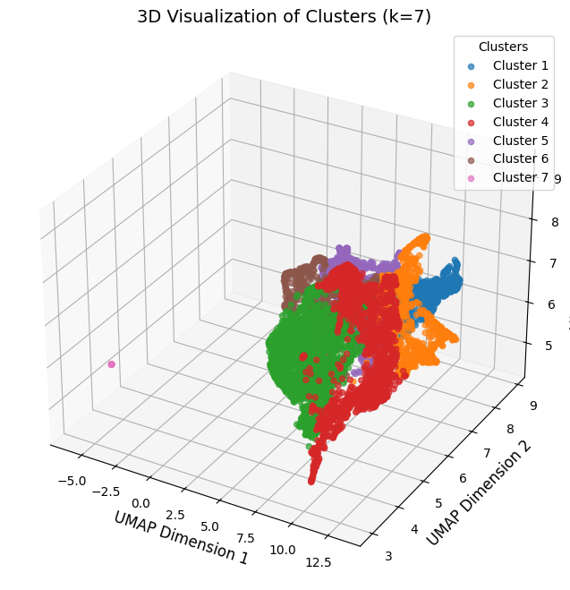

# Number of Clusters Discovery
## K-means Clustering on Word Co-occurrence Embeddings

**Dwijesh Dookraz**


---

## Overview

This project discovers the optimal number of semantic word clusters in the [text8](http://mattmahoney.net/dc/textdata.html) corpus — a 17-million token Wikipedia extract — using co-occurrence embeddings, dimensionality reduction, and K-means clustering.

**Key findings:**
- **9,265 unique words** retained after preprocessing (frequency filter 50–5,000, lemmatisation, synonym mapping)
- Co-occurrence matrix (window = 5) + L2 normalisation → PCA (20D) → UMAP (5D) pipeline produces well-separated clusters
- Optimal **k = 7** selected via Occam's Razor — silhouette score plateaus after k = 7, further splits add complexity without gain
- Validation silhouette = **0.698**, test silhouette = **0.633** — minimal degradation on unseen data

---

## Dataset

| Property | Value |
|----------|-------|
| Source | [text8](http://mattmahoney.net/dc/textdata.html) |
| Size | 100 MB / ~17M tokens |
| Tokeniser | NLTK Punkt |
| Vocabulary | 9,265 words |
| Split | 64 % train / 16 % validation / 20 % test |

**Preprocessing:** lowercase → non-ASCII removal → alphabetic filter → stopword removal → length filter (3–18 chars) → lemmatisation → POS-aware synonym mapping → frequency filter (50–5,000 occurrences)

---

## Pipeline

```
text8 (17M tokens)
  → Punkt tokenisation + stopword removal + length filter (3–18 chars)
  → Lemmatisation + POS-aware synonym mapping
  → Frequency filter (50–5,000 occurrences) → 9,265 unique words
  → Co-occurrence matrix (window = 5) + L2 normalisation  [9265 × 9265]
  → PCA (20 components)
  → UMAP (5 components, n_neighbors=10, min_dist=0.1)
  → K-means (k = 2 … 19) evaluated by Silhouette Score on validation set
  → Optimal k = 7
```

---

## Results

### 1 — Silhouette Score vs. Number of Clusters

Silhouette score peaks within k < 8 at **k = 7** (score = 0.698). Beyond k = 7 scores continue rising but reflect overfitting — clusters become smaller and less interpretable.



---

### 2 — Inertia (Elbow Method)

Inertia decreases consistently with k. The elbow is visible at **k = 7**, after which gains diminish — consistent with the silhouette-based selection.



---

### 3 — 3D Cluster Visualisation (k = 7)

UMAP dimensions 1–3 plotted. Seven clusters are spatially well-separated, confirming meaningful semantic groupings in the co-occurrence embedding space.



---

### 4 — Clustering Results

| K | Validation Silhouette | Train Inertia |
|---|----------------------|---------------|
| 3 | 0.611 | 40213.301 |
| 4 | 0.632 | 33751.602 |
| 5 | 0.653 | 29646.887 |
| 6 | 0.661 | 25722.094 |
| **7** | **0.698** | **23330.656** |

Test Silhouette Score at k = 7: **0.633**

---

## Interpretation

The UMAP embedding preserves both local and global co-occurrence structure. At **k = 7**, the clusters correspond to broad semantic domains — the model captures meaningful word relationships without overfitting to noise.

Applying Occam's Razor: although silhouette scores continue rising at higher k values, the additional clusters fragment coherent semantic groups. **k = 7 balances compactness, separation, and interpretability.**

---

## Limitations

- text8 is pre-tokenised Wikipedia — results may not generalise to other corpora
- Co-occurrence window (5) is fixed; optimal window may vary by downstream task
- UMAP is non-deterministic; minor variation in cluster boundaries across runs
- Synonym mapping uses WordNet POS tags — coverage limited to English wordnet

---

## Repository

| File | Description |
|------|-------------|
| [`kmeans_clustering.ipynb`](kmeans_clustering.ipynb) | Full reproducible pipeline |
| [`figures/`](figures/) | Silhouette, elbow, and 3D cluster plots |
| [`report.pdf`](report.pdf) | Write-up |
| [`requirements.txt`](requirements.txt) | Python dependencies |

### Quickstart

```bash
pip install -r requirements.txt
jupyter notebook kmeans_clustering.ipynb
```

> Download **text8** from [mattmahoney.net](http://mattmahoney.net/dc/text8.zip), extract, and place the `text8` file in the repo root before running.

---

## Key Dependencies

| Package | Purpose |
|---------|---------|
| `nltk` | Punkt tokeniser, stopwords, WordNet lemmatiser |
| `umap-learn` | UMAP dimensionality reduction |
| `scikit-learn` | PCA, K-means, Silhouette Score |
| `scipy` | Sparse co-occurrence matrix |
| `tqdm` | Progress bars |
